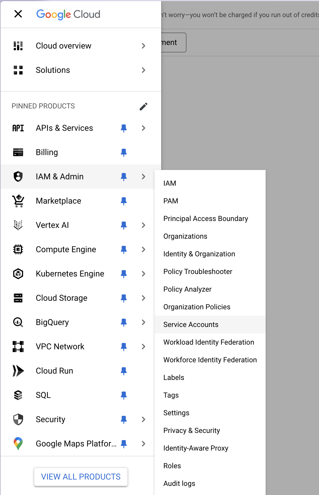
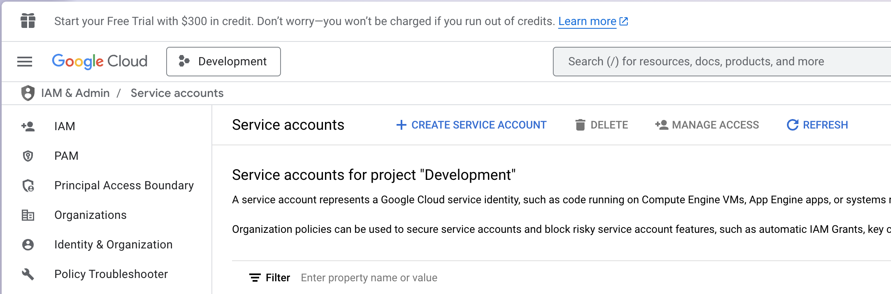
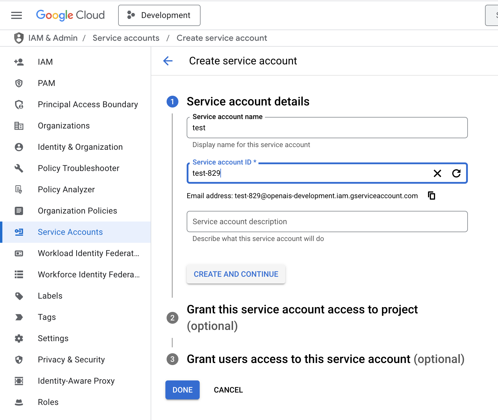
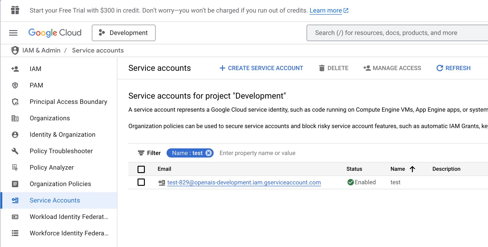
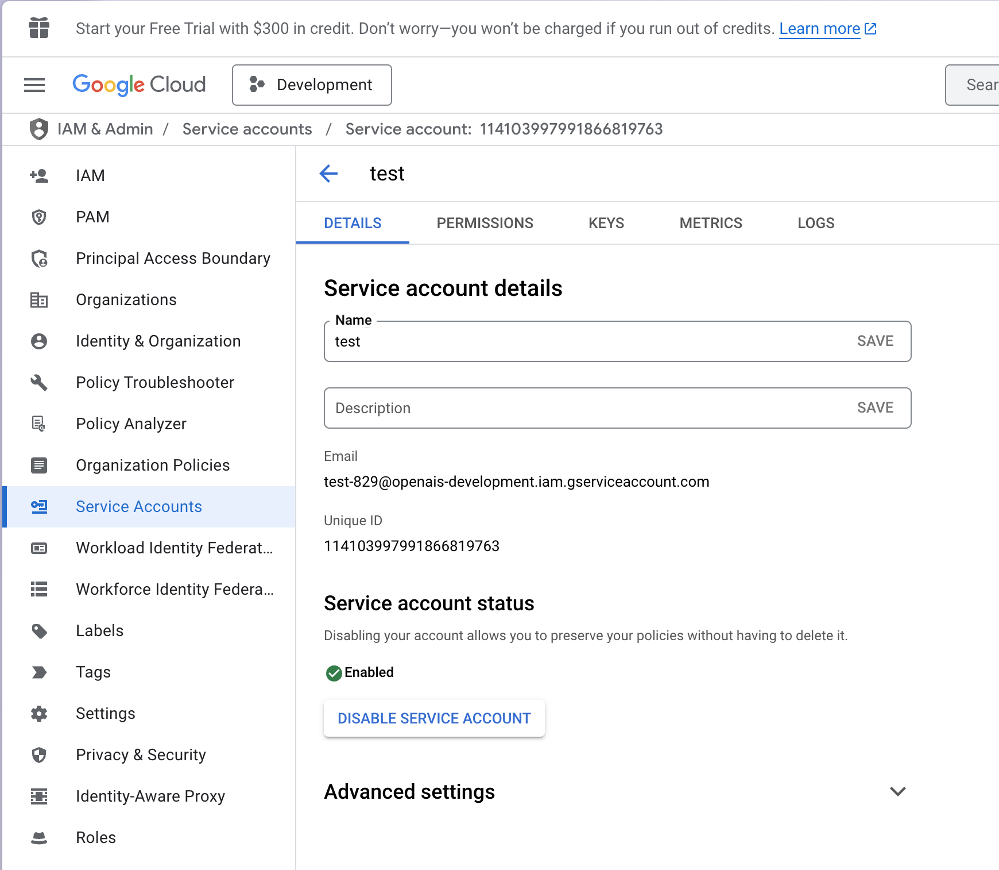
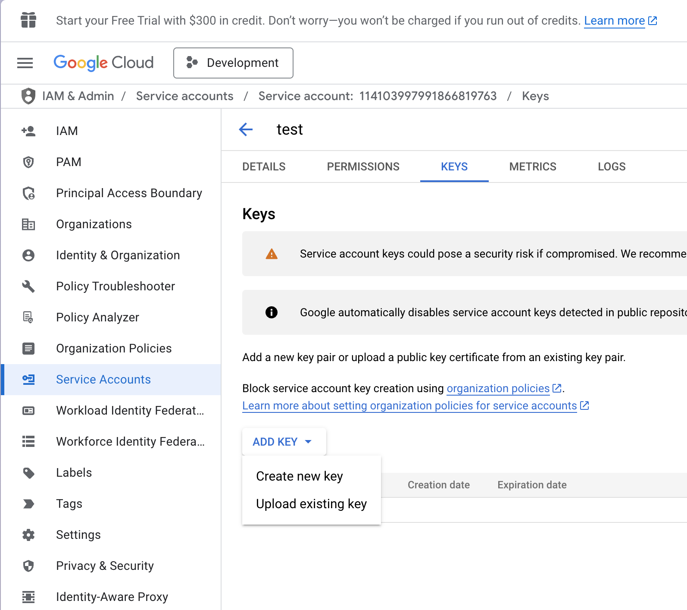
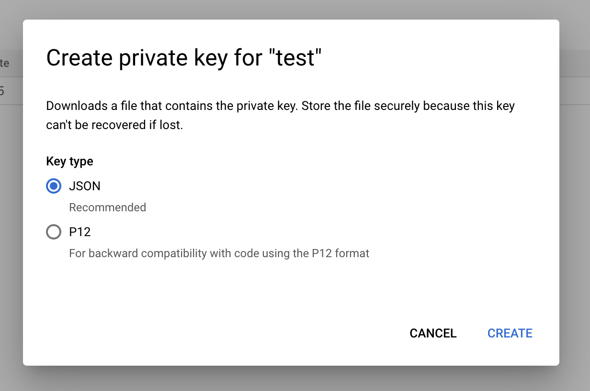

# SheepDB Setup Guide

This guide walks you through the process of setting up and configuring SheepDB with Google Sheets.

## Enabling Google Sheets API

1. Navigate to [Google Cloud Console](https://console.cloud.google.com) and select your project
2. In the left sidebar, click on "APIs & Services" > "Library"
3. Search for "Google Sheets API" in the search bar
4. Click on the "Google Sheets API" card
5. Click "ENABLE" to activate the API for your project

## Creating a Service Account

1. Navigate to [Google Cloud Console](https://console.cloud.google.com) and select your project
2. Go to **IAM & Admin** > **Service Accounts**

  

3. Click "+ Create Service Account"

  

4. Fill in the required information and click "Create"

  

5. Select the newly created service account

  

6. Navigate to the "Keys" tab

  

7. Click "ADD KEY" > "Create new key"

  

8. Select "JSON" as the key type and click "Create"

  

9. The JSON key file will automatically download

## Configuring Environment Variables

### Setting up GOOGLE_CLIENT_EMAIL

1. Open the downloaded service account JSON file
2. Locate the `client_email` field
3. Copy its value and set it as your `GOOGLE_CLIENT_EMAIL` environment variable

### Setting up GOOGLE_PRIVATE_KEY

1. In the same JSON file, locate the `private_key` field
2. Copy its value and set it as your `GOOGLE_PRIVATE_KEY` environment variable

## Configuring Google Spreadsheet

### Getting the Spreadsheet ID

1. Open your target spreadsheet in Google Drive
2. Click the "Share" button
3. Copy the spreadsheet URL (e.g., `https://docs.google.com/spreadsheets/d/83xjdK-cJz0XKYufn7APYchtxqRkRNXgSunow8i8jG0/edit?usp=sharing`)
4. Extract the Spreadsheet ID from the URL (e.g., `83xjdK-cJz0XKYufn7APYchtxqRkRNXgSunow8i8jG0`)
5. Set this ID as your `GOOGLE_SPREADSHEET_ID` environment variable

### Granting Service Account Access

1. Open your spreadsheet's sharing settings
2. Click the "Share" button
3. Add the service account email (value of `GOOGLE_CLIENT_EMAIL`)
4. Ensure the service account has "Editor" access
5. Click "Done"

## Verification

To verify your setup:

1. Ensure all environment variables are properly set:
   - `GOOGLE_CLIENT_EMAIL`
   - `GOOGLE_PRIVATE_KEY`
   - `GOOGLE_SPREADSHEET_ID`
2. Try running a basic SheepDB command to test the connection

## Troubleshooting

If you encounter issues:

- Verify that the Google Sheets API is enabled in your Google Cloud Project
- Confirm that the service account has the correct permissions
- Check that all environment variables are properly formatted
- Ensure the spreadsheet ID is correct

For additional help, please refer to our [README.md](./README.md) or open an issue on GitHub.
