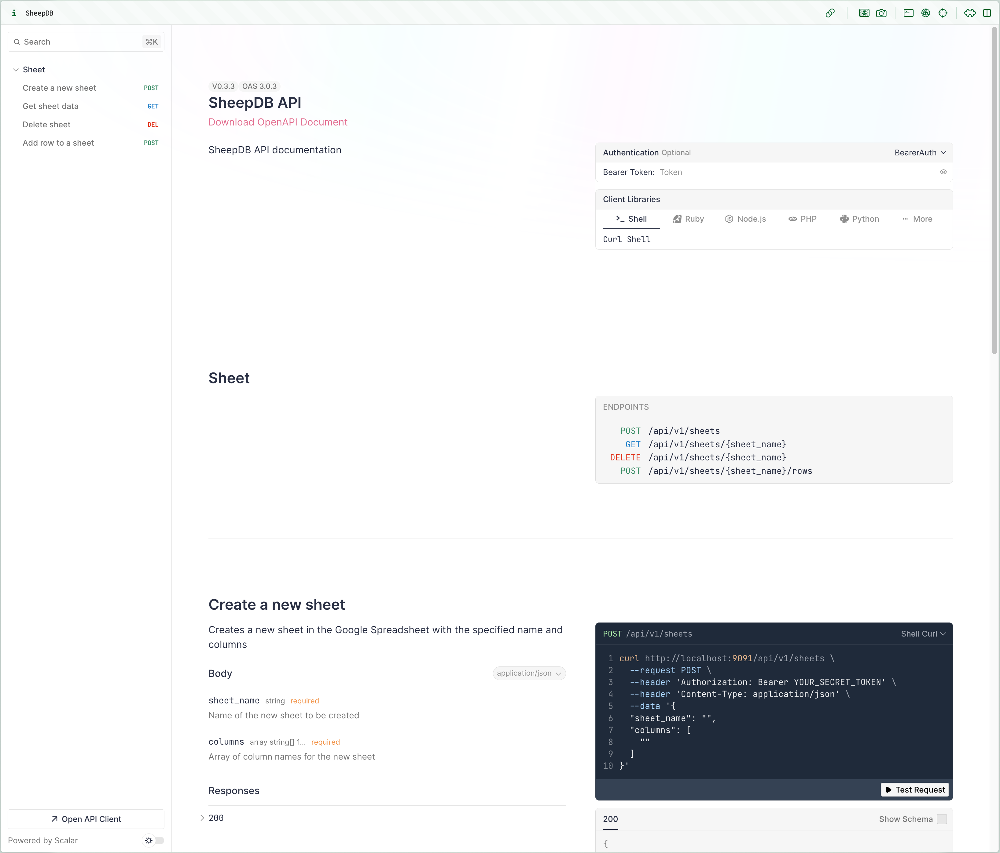

<p align="center">
  
</p>

# SheepDB

SheepDB is a lightweight service that uses Google Spreadsheets as a storage backend. It provides both a CLI interface and an API server for managing your data.

<p align="center">
  
</p>

## Features

- 🔄 Use Google Spreadsheets as a database
- 🌐 Full CRUD operations via HTTP endpoints
- 📊 Rich query capabilities for data retrieval
- 🔐 Secure authentication for API endpoints

## Prerequisites

- Google Cloud Project with enabled Google Sheets API
- Google Service Account credentials

For detailed instructions on setting up these prerequisites, please refer to our [Setup Guide](./HOW-TO.md).

## Installation

You can download the latest release from [here](https://github.com/openais-io/sheepdb/releases).

## Configuration

Configure the required environment variables by either setting them directly or using a .env file located in the same directory as the SheepDB executable:

```bash
GOOGLE_CLIENT_EMAIL=your-service-account@project.iam.gserviceaccount.com
GOOGLE_PRIVATE_KEY=your-service-account-private-key # You can get the value from the service-account.json file
GOOGLE_SPREADSHEET_ID=your-spreadsheet-id
API_KEY=your-api-key  # Required for API server
```

**IMPORTANT:** After configuring your environment variables, remember to grant "Editor" access to your Google Spreadsheets for the email address specified in GOOGLE_CLIENT_EMAIL.

## Getting Started

Run the API server using the following command:

```bash
sheepdb
```

## API Endpoints

The API documentation is available at `/api/docs` when running the server.

### Filter Operations

SheepDB supports various filter operations:

- **Simple Equality**: `{"field": value}`
- **String Operations**:
    - StartsWith: `{"field": {"startsWith": "prefix"}}`
    - EndsWith: `{"field": {"endsWith": "suffix"}}`
    - Contains: `{"field": {"contains": "substring"}}`
- **Comparison Operations**:
    - Greater Than: `{"field": {"gt": value}}`
    - Greater Than or Equal: `{"field": {"gte": value}}`
    - Less Than: `{"field": {"lt": value}}`
    - Less Than or Equal: `{"field": {"lte": value}}`
- **Array Operations**:
    - In: `{"field": {"in": [value1, value2]}}`
    - Not In: `{"field": {"notIn": [value1, value2]}}`
    - Between: `{"field": {"between": [min, max]}}`
    - Not Between: `{"field": {"notBetween": [min, max]}}`
- **Null Operations**:
    - Is Null: `{"field": {"isNull": true}}`
    - Is Not Null: `{"field": {"isNotNull": true}}`

## Troubleshooting

If you encounter any issues, please open an issue on GitHub.

## License

Apache License 2.0

Copyright (c) 2025 OpenAIS

Licensed under the Apache License, Version 2.0 (the "License");
you may not use this file except in compliance with the License.
You may obtain a copy of the License at

    http://www.apache.org/licenses/LICENSE-2.0

Unless required by applicable law or agreed to in writing, software
distributed under the License is distributed on an "AS IS" BASIS,
WITHOUT WARRANTIES OR CONDITIONS OF ANY KIND, either express or implied.
See the License for the specific language governing permissions and
limitations under the License.
